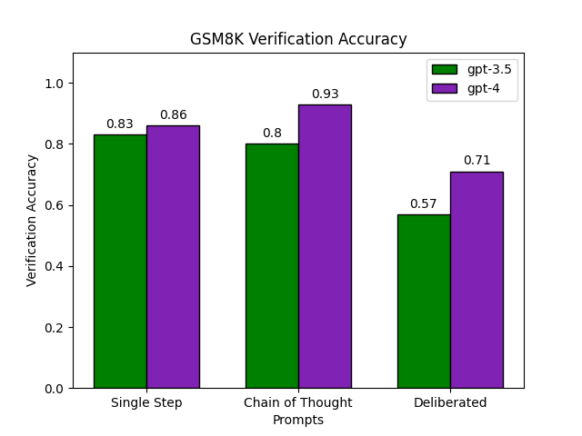
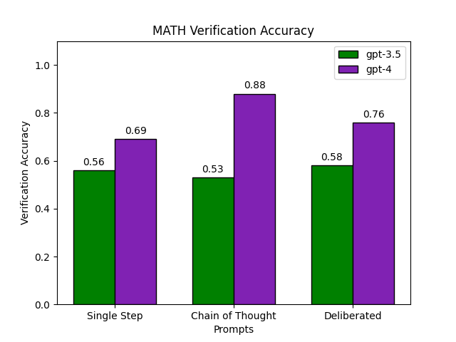
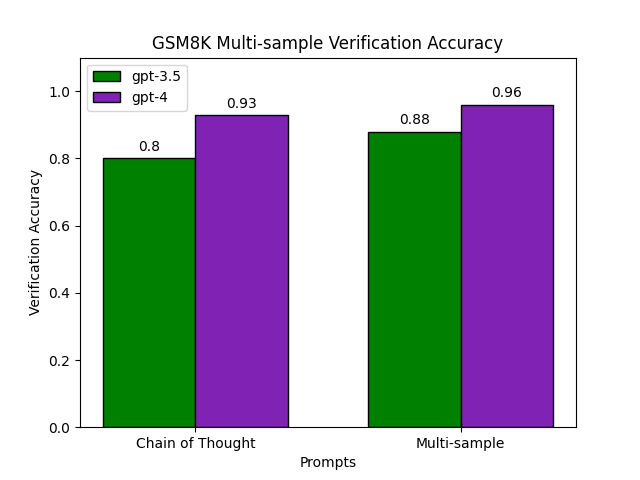
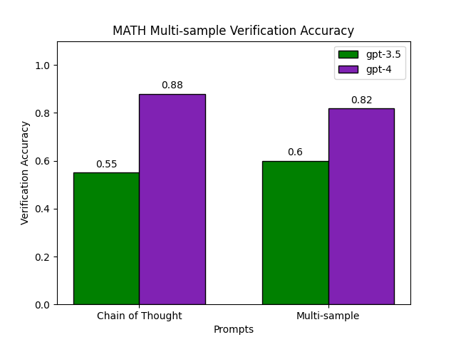
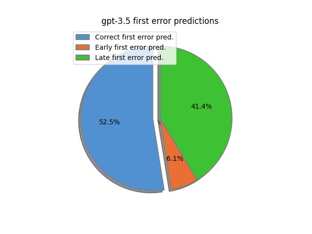
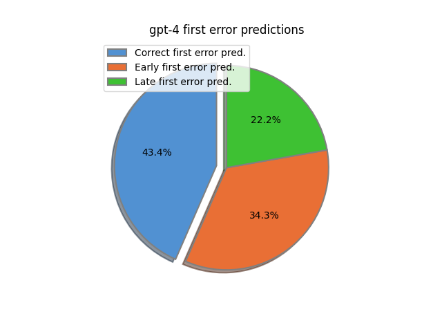
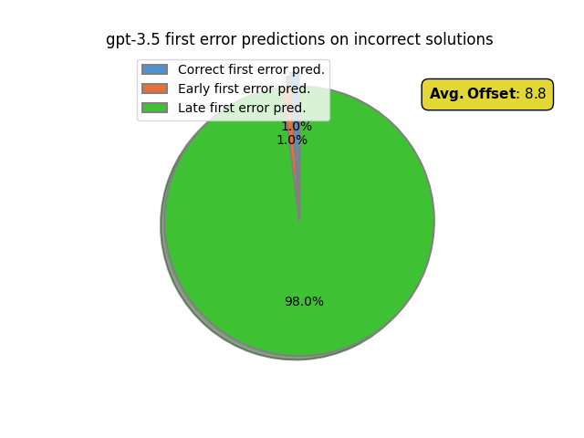
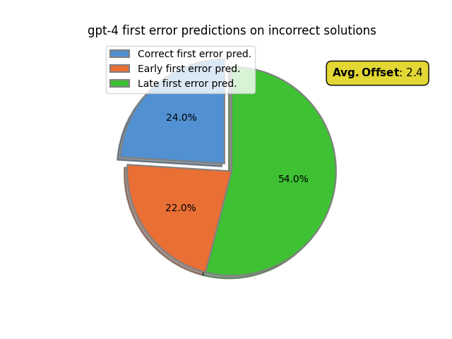
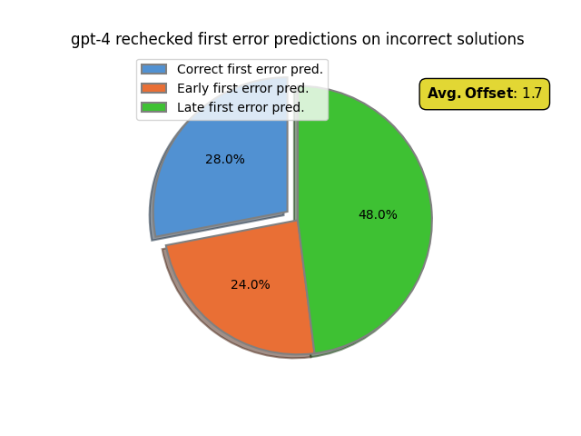

# Evaluating the zero-shot verification abilities of GPT-4 on math problems

Recent work [[1]](#references) studies the ability of SOTA large language models to reliably refine incorrect answers to math problems without any external feedback. Correctly refining a solution draft $D$ of a question $Q$ is a difficult task, requiring the model to first decide *when* to refine and then *where* and *how* to refine. SOTA models struggle to reliably decide when to refine incorrect drafts, immediately limiting refinement performance. Working mathematicans are adept at identifying reasoning errors and gauging the expected outcome of a proof strategies. Thus improving the abilitiy of an LLM to act as a zero-shot verifier of reasoning traces is crucial for advanced understanding of mathematics. 

In this work we examine the zero-shot abilities of LLMs to generate and *verify* correctness of candidate solutions in GSM8K [[2]](#references) and MATH [[3]](#references). We primarily consider verifying final answer correctness, but additionally evaluate the ability of of LLMs to identify step level errors on solutions to problems in the MATH dataset using labels released in [[4]](#references). We benchmark several prompting strategies including single-token verification, Chain of Thought (**CoT**), and debate. We then propose a new strategy we call **in-context multi-sample classification**. This new method encourages the verifier to compare and contrast multiple diverse candidate solutions to the same question in-context, leading to improved performance in some cases.

## Part 1: Baselines for zero-shot verification

We begin by evaluating the accuracy of `gpt-3.5-turbo-1106` and `gpt-4-preview-1106` as final answer verifiers. To construct a test set for GSM8K we greedily sample `gpt-3.5-turbo-1106` on all GSM8K test prompts. This forms a set of $(Q,A)$ pairs which can be verified for correctness. We find 83% of generated samples correctly solve the question while the remaining 17% are incorrect. We label the correct solutions as "positive" and the rest as "negative". We construct a verification test set for MATH similarly, with 43% of the candidate solutions labeled as "positive" and the rest as "negative". Note, to save on api costs, we use a 1000 sample subset of the full 5000 sample MATH test set which we found to be representative. To evaluate correctness of final answers in GSM8K we use a similar parsing and extraction scheme as used in Minverva [[5]](#references). For MATH we use the same evaluation code as in [[4]](#references).

[ADD EXAMPLE PROMPT HERE]

We evaluate several baseline prompting methods. These include single step prompting, where the model generates a single 'positive' or 'negative' token following the (Q, A) pair, chain of thought, and a debate prompt where the model lists pros and cons of the solution before coming to a final verdict. In particular when doing chain of thought, we instruct the verifier to examine each invididual step of the solution before coming a final verdict. This is important, as otherwise even gpt-4 often produces a final verdict and subsequent post-hoc rationalization instead of delaying a final verdict until the end of its completion. Specific prompt formats can be found in [`prompts.py`](prompts.py). All models are sampled at temperature $T = 0$. Results are reported below.

  <figure style="width: 40%;">
  
  <figcaption>Accuracy of verifiers on GSM8K verification test set.</figcaption>
</figure> 
  <figure style="width: 40%;">
  
  <figcaption>Accuracy of verifiers on MATH verification test set.</figcaption>
</figure>

On GSM8K both gpt-3.5 and gpt-4 successfully verify the correctness test problems with over 80% accuracy. gpt-4 in particular performs very well, successfully verifying 93% of solutions when going step by step. Curiously, forcing gpt-3.5 to make a single token prediction slightly increases verification accuracy. Yet verification accuracy for gpt-4 decreases by 8% without an additional chain of thought. This suggests gpt-3.5 is not making effective use of intermediate reasoning whereas gpt-4 effectively leverages it for significant improvement. Deliberative prompting performs poorly, significantly reducing accuracy for both models.

On MATH gpt-3.5 as a verifier performs much worse. At best it gets 58%: near random guessing accuracy. This is perhaps somewhat surprising as gpt-3.5 is able to successfully solve 41% of MATH problems. In contrast, gpt-4 again performs very well, correctly verifying up to 88% of candidate solutions. The relative performance of prompting strategies stays similar with chain of thought working best for gpt-4 and single-step working best for gpt-3.5. To better understand verifier failure modes we can examine precision and recall statistics.

  <table style="flex: 1; margin-right: 20px; width: 40%;">
    <caption>Classification statistics for chain of thought verifiers on GSM8K.</caption>
    <tr>
      <th> GSM8K </th>
      <th>gpt-3.5</th>
      <th>gpt-4</th>
    </tr>
    <tr>
      <td>Precision</td>
      <td>0.86</td>
      <td>0.96</td>
    </tr>
    <tr>
      <td>Recall</td>
      <td>0.91</td>
      <td>0.96</td>
    </tr>
    <tr>
      <td>F1</td>
      <td>0.88</td>
      <td>0.96</td>
    </tr>
    <tr>
        <tr style="border-bottom:1px solid black">
        <td colspan="100%"></td>
  </tr>
    </tr>
    <tr>
      <td>Predicted Correct</td>
      <td>0.89</td>
      <td>0.81</td>
    </tr>
    <tr>
      <td>Actual Correct</td>
      <td colspan="100%" style="text-align: center;">0.83</td>
    </tr>
  </table>

  <table style="flex: 1; margin-left: 20px; width: 40%;">
    <caption>Classification statistics for chain of thought verifiers on MATH.</caption>
    <tr>
      <th> MATH </th>
      <th>gpt-3.5</th>
      <th>gpt-4</th>
    </tr>
    <tr>
      <td>Precision</td>
      <td>0.47</td>
      <td>0.84</td>
    </tr>
    <tr>
      <td>Recall</td>
      <td>0.8</td>
      <td>0.89</td>
    </tr>
    <tr>
      <td>F1</td>
      <td>0.59</td>
      <td>0.86</td>
    </tr>
    <tr>
        <tr style="border-bottom:1px solid black">
        <td colspan="100%"></td>
  </tr>
    </tr>
    <tr>
      <td>Predicted Correct</td>
      <td>0.7</td>
      <td>0.45</td>
    </tr>
    <tr>
      <td>Actual Correct</td>
      <td colspan="100%" style="text-align: center;">0.41</td>
    </tr>
  </table>

On GSM8K both verifiers have good precision and recall. Overall gpt-3.5 tends to be overly-lenient, classifying 89% of candidate solutions as correct when in reality only 83% are correct. This results in precision being non-trivially lower than recall. This gap is significantly worse on the MATH dataset, with gpt-3.5 getting 0.8 recall but 0.47 precision. This suggests gpt-3.5 as a reasoning verifier admits a high rate of false positives. The model predicts 70% of answers are correct when in reality only 41% are correct.

gpt-4 also admits more false positives than negatives on MATH verification. However, this difference is much smaller than with gpt-3.5, giving a precision and recall of 0.86 and 0.91 respectively. This suggests current LLMs in general are overly-lenient when verifying reasoning, likely overlooking crucial errors at the step level. This is the opposite of the kind of behavior we might want from a model capable of advanced mathematical reasoning. Human mathematicians are trained to be skeptical of candidate proof until they are absolutely convinced of correctness. This likely results in some false negatives, correct proofs labeled as containing an error, but ensures virtually no false positives.

## Part 2: In-context multi-sample verification

Closely related to using LLMs as reasoning verifiers is using LLMs as a judge to choose among two (or more) candidate completions given a task. Several works (CITE) demonstrate gpt-4 is capable of correctly judging between completion pairs on a wide range of tasks. Most often the judge is conditioned on both responses in the same context and asked to give a preference, though a preference can also be extracted from scores assigned independently from one another. Inspired by this approach, we propose to improve LLM verification ability conditioning the verifier on multiple, diverse candidate solutions in-context. Formally, we ask the model to predict $p(\texttt{is\_correct}(A_1) | Q, A_2)$ where $A_1, A_2$ are candidate solutions and $Q$ is the problem statement. Intuitively, we hope including multiple diverse solutions will encourage the model to compare and contrast all candidates, improving overall accuracy. For example, clearly if two solutions have differing final answers then at least one of them must be incorrect. We call this approach *in-context multi-sample verification*.

To construct verification test sets for GMS8K and MATH we sample `gpt-3.5-turbo-1106` five times per test question (in the case of MATH we use the same 1000 question subset as before) at temperature $T = 1.0$. The resulting GSM8K solutions correctly solve the given questions 83% of the time. 40% of sampled MATH solutions are correct. To construct multi-sample verification test sets we sample $K$ many solutions $A_1,...,A_K$ per problem (with most often $K=2$), prioritizing pairs which result in different final answers to maximize solution diversity. To allow for comparability to our baselines, we randomly set $A_i$ as the solution greedily generated by gpt-3.5. Note however, we cannot always find diverse solutions for all questions, resulting in some pairs ending with the same final answer. At test time verifiers are then prompted with a question $Q$ and two candidate solutions $A_1, A_2$ with instructions to compare and contrast both solutions at the step level before coming to final verdicts for both problems. [LINK PROMPT HERE]

  <figure style="width: 40%;">
  
  <figcaption>Accuracy of (multi-sample) verifiers on GSM8K verification test set.</figcaption>
</figure> 
  <figure style="width: 40%;">
  
  <figcaption>Accuracy of (multi-sample) verifiers on MATH verification test set.</figcaption>
</figure>

  <table style="flex: 1; margin-right: 20px; width: 40%;">
    <caption>Classification statistics for multi-sample verifiers on GSM8K.</caption>
    <tr>
      <th> GSM8K </th>
      <th>gpt-3.5</th>
      <th>gpt-4</th>
    </tr>
    <tr>
      <td>Precision</td>
      <td>0.93</td>
      <td>0.97</td>
    </tr>
    <tr>
      <td>Recall</td>
      <td>0.94</td>
      <td>0.98</td>
    </tr>
    <tr>
      <td>F1</td>
      <td>0.93</td>
      <td>0.97</td>
    </tr>
    <tr>
        <tr style="border-bottom:1px solid black">
        <td colspan="100%"></td>
  </tr>
    </tr>
    <tr>
      <td>Predicted Correct</td>
      <td>0.81</td>
      <td>0.83</td>
    </tr>
    <tr>
      <td>Actual Correct</td>
      <td colspan="100%" style="text-align: center;">0.83</td>
    </tr>
  </table>

  <table style="flex: 1; margin-left: 20px; width: 40%;">
    <caption>Classification statistics for multi-sample verifiers on MATH.</caption>
    <tr>
      <th> MATH </th>
      <th>gpt-3.5</th>
      <th>gpt-4</th>
    </tr>
    <tr>
      <td>Precision</td>
      <td>0.5</td>
      <td>0.77</td>
    </tr>
    <tr>
      <td>Recall</td>
      <td>0.85</td>
      <td>0.92</td>
    </tr>
    <tr>
      <td>F1</td>
      <td>0.63</td>
      <td>0.83</td>
    </tr>
    <tr>
        <tr style="border-bottom:1px solid black">
        <td colspan="100%"></td>
  </tr>
    </tr>
    <tr>
      <td>Predicted Correct</td>
      <td>0.67</td>
      <td>0.49</td>
    </tr>
    <tr>
      <td>Actual Correct</td>
      <td colspan="100%" style="text-align: center;">0.41</td>
    </tr>
  </table>

On GSM8K multi-sample verification improves both gpt-3.5 and gpt-4 predictions, in particular significantly improving gpt-3.5 from 80% to 88% accuracy. As desired, most of this increase is due to precision improving from 86% to 93% while also simultaneously improving recall. I.e. multi-sample prompting seems to improve the verifier's ability to recognize incorrect solutions. Smaller improvements are also seen for gpt-4. However, on the MATH benchmark multi-sample prompting does not appear to have as much benefit. While gpt-3.5 experiences some improvement, gpt-4's accuracy diminishes by 4%. Worse, most of this loss is due to a 7% drop in precision, with recall improving from 89% to 92%. This is the opposite of what we hoped. This is a bit surprising, as somehow multi-sample prompting has increased the precision of gpt-3.5 but decreased gpt-4's precision.

[Do analysis of errors] One possible explanation of this counterintuitive behavior is that sample pairs with differing final answer decrease model confidence in correctness. Conversely, sample pairs whose final answers agree increase model confidence in correctness.

### Evaluating gpt-4 as an in-context reranker

To better understand the in-context multi-sample reasoning abilities of gpt-4 we also evaluate its ability to act as a reranker on MATH. To construct a test we sample `gpt-3.5-turbo-1106` $K = 5$ times at temperature $T = 1.0$ on our 1000 question subset of the MATH test set. We then filter out questions for which the correct final answer was never reached in any of the five samples. This leaves us with 526 samples remaining. We then prompt gpt-4 to act as an in-context reranker by putting all five solutions in-context and prompting gpt-4 to choose the most promising. As a baseline we additionally consider maj@5 score and measure the agreement bewteen gpt-4 and the maj@5 selected final answer.

<table style="flex: 1; margin-left: 20px; text-align: left;">
    <caption>Rerank statistics for gpt-4 on MATH. Rerank maj. agreement measures the percentage of questions for which gpt-4 and the majority agree on the correct final answer. rerank@5 slightly beats maj@5. gpt-4 disagrees with the majority 25% of the time. Note: pass@5 = 1.0 because we filter out questions not containing a correct solution beforehand.</caption>
    <tr>
      <th>rerank@5</th>
      <th>maj@5</th>
      <th>pass@5</th>
      <th>Rerank maj. agreement</th>
    </tr>
    <tr>
      <td>0.8</td>
      <td>0.78</td>
      <td>1.0</td>
      <td>0.74</td>
    </tr>
</table>

Overall gpt-4 edges out maj@5 with an 80% versus 78% successful selection rate. More interestingly, despite having similar accuracies, gpt-4 disagrees with majority on the correct final answer 25% of the time. This suggests while gpt-4 may be somewhat sensitive to simply counting the majority final answer, it is not overly sensitive. This non-overlap could potentially be exploited using a two-tiered reranking system, with an ensemble of rerankers used to select the most promising candidates at one level and a single reranker used to choose the best among an ensemble of candidates.

One obvious limitation of the in-context reranking approach is the limitation of context length in reranking. Scaling to larger numbers of samples could prove difficult, as even a single solution can require up to 2k tokens.

## Part 3: Step level verification

So far, we have obtained our best verification results by encouragaging the verifier to inspect each line in a solution step by step, checking for an error. For gpt-4 this significantly improves performance over single-step verification. However, it remains unclear how good the verifier actually is at identifying errors at the step level. Intuitively, a verifier good at verifying the final answer should also work well when verifying intermediate steps. From the refinement perspective, a model's ability to identify the location of errors at the step level is crucial for knowing what part of a solution to refine. Even if a model is capable of evaluating the final outcome correctly, and thus knows it should refine, it must still determine where exactly the refinement should occur. A model unable to pinpoint the source of downstream errors will struggle at this stage in the refinement pipeline as well.

To evaluate our verifiers' step-level accuracy we solutions with step-level human labels gathered in [[4]](#references) to train a process based reward model. We construct a verification test set for MATH by taking a 411 sample subset of the second round of prm data collected for the MATH test set. To ensure accurate evaluation we filter out all questions whose answers we cannot reliably evaluate automatically (e.g. complex symbolic expressions). 59% of samples in the resulting dataset are correct solutions to their respective problems.

We then prompt our verifier to verify step by step, explicitly producing intermediate labels $l_1,...,l_L$ for all steps $S_1,...,S_L$ in the candidate solution. We measure both the overall accuracy of the verifiers on all step labels as well as the verifiers' accuracy at predicting the first error (if present) in a solution. We define the *first error* of an incorrect solution as the step containing the first mistake and the first error of an incorrect solution as equal to the number of steps + 1. We additionally define the first error *step offset* as the difference in step location between the ground truth step error and the predicted step error, i.e. `step_offset = loc(gt_first_error) - loc(pred_first_error)`.

The first measure of overall step label accuracy is not particularly informative as all step labels in a solution are "positive" until the first error, after which they are "negative". Thus when measuring overall step level label accuracy we ignore all model predictions after the first ground truth first error. Tracking the accuracy of the model at predicting the location of the first error is of the most interest to us. To better understand first error prediction failure modes we track three additional metrics: the percentage of solutions where the verifier predicts an error before one has occurred, the percentage of solutions where the verifier predicts an error after one has already occured, and the average step offset between when the first error occurs and when the verifier predicts it occurs.

  <figure>
      <table>
      <caption>Step level verification statistics on MATH. Accuracy reports overall accuracy on all labels. First error accuracy reports accuracy at correctly predicting the location of the first error. Avg. first error offset measures where the difference between the ground truth first error location and the predicted first error location.</caption>
      <tr>
        <th>Model</th>
        <th>Outcome accuracy</th>
        <th>Step accuracy</th>
        <th>Avg. first error offset</th>
      </tr>
      <tr>
        <td>gpt-3.5</td>
        <td>0.58</td>
        <td>0.92</td>
        <td>3.2</td>
      </tr>
      <tr>
        <td>gpt-4</td>
        <td>0.75</td>
        <td>0.74</td>
        <td>-0.62</td>
      </tr>
    </table>
  </figure>

  <figure style="width: 40%;">
  
  <figcaption>Breakdown of gpt-3.5 first error predictions.</figcaption>
</figure> 
  <figure style="width: 40%;">
  
  <figcaption>Breakdown of gpt-4 first error predictions.</figcaption>
</figure>

We find gpt-3.5 again performs poorly at verifying the final answer. Yet, it appears to have a very good overall step level accuracy. This is misleading as the gpt-3.5 verifier almost always verifies a step as correct and 95% of step labels are "positive" since we stop evaluation after the first error. For the same reason, gpt-3.5 seemingly does a good job of predicting the location of the first error. When looking at the failure modes we see the model almost always predicts the first error too late but never too early. To better understand gpt-3.5's ability to identify errors when present we should instead look at first error accuracy on a subset containing only incorrect solutions.

gpt-4 final verification accuracy on this test set is worse compared to earlier experiments. We hypothesize this is because the model generated candidate solutions are of a higher quality than those generated by gpt-3.5, making it harder to identify obviously incorrect answers. At the step level, gpt-4 has a more balanced first error rate than gpt-3.5, despite having a lower overall accuracy. In particular gpt-4 has an average first error offset of -0.62, indicating gpt-4 predicts the first error slightly too early when averaged across both correct and incorrect solutions. 

To better understand how both verifiers perform at detecting the presence of errors we now only evaluate on the subset of solutions containing mistakes.

  <figure style="width: 40%;">
  
  <figcaption>Breakdown of gpt-3.5 first error predictions on subset containing all incorrect solutions.</figcaption>
</figure> 
  <figure style="width: 40%;">
  
  <figcaption>Breakdown of gpt-4 first error predictions on subset containing all incorrect solutions.</figcaption>
</figure>

Looking at these predictions we see gpt-3.5 is essentially unable identify mistakes. gpt-4 does nontrivially better, genuinely identifying 24% of first errors. Further, we can see that gpt-4 most identifies errors too late most often: around 54% of the time. This is somewhat intuitive, as the even for human mathematicians the source of an error may not immediately be apparent. Yet downstream from the error it becomes easier to identify one has occurred as we can start to draw more obviously invalid conclusions. In gpt-4's case this "realization" occurs on average 2.4 steps after the first error. This also partially explains the huge gap between final outcome accuracy, 75%, and first error accuracy.

### Improving first error prediction via rechecking

Human mathematicians backtrack when confronted with obviously incorrect statements. This makes the task of detecting an error much easier, as now we can be sure an error does exist at or before the contradiction. gpt-4 does not perform this backtracking by default, but we can simulate this behavior through iterative prompting. In particular, once the verifier has produced intermediate step verifications and verified an entire solution as incorrect, we prompt it again to "recheck" its step by step work carefully with the knowledge there is an error somewhere. This encourages the model to perform the same backtracking as a human mathematician.

<figure>
  
  <figcaption>Breakdown of gpt-4 rechecked first error predictions on subset containing all incorrect solutions.</figcaption>
</figure>

Rechecking mildly improves the first error prediction accuracy of gpt-4 from 24% to 28%. The percentage of late first error predictions also decreases from 54% to 48%. This results in the average first error offset decreasing from 2.4 to 1.7. These results indicate rechecking does successfully improve the verifier's ability to localize the first error, though perhaps not as much as we may have hoped.

## Conclusions

In this post we took an in-depth look at the verification abilities of SOTA large language models (`gpt-3.5-turbo-1106` and `gpt-4-turbo-1106`). In addition to being useful for refinement, the ability to gauge a solution's correctness and localize errors is crucial to a deeper understanding of mathematics beyond mere imitation of valid proof. We found that even the best models significantly struggle with precisely identifying sources of error. We see improving this ability as central to the next generation of LLM reasoners.

## References

[1]: Cite refining failure paper

[2]: Cite GSM8K

[3]: Cite math

[4]: Cite PRM paper

[5]: Cite Minverva
